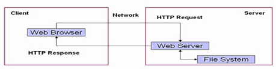

## [JavaWeb学习总结（一）— JavaWeb开发入门](http://www.cnblogs.com/xdp-gacl/p/3729033.html)

### 一、基本概念

#### 1.1 WEB开发的相关知识

* 静态web资源：指web页面中供人们浏览的数据是始终不变的。

  技术：HTML/CSS/JS

* 动态web资源：指web页面中供人们浏览的数据是由程序产生，不同时间点访问web页面看到的内容各不相同。

  技术：JSP/Servlet、ASP、PHP等

#### 1.2 WEB应用程序

* web应用程序指供浏览器访问的程序，通常也简称为web应用。
* web应用开发好后，若想供外界访问，需要把web应用所在的目录交给web服务器管理，这个过程称之为虚拟目录的映射。

#### 1.3 WEB发展史

静态->动态

#### 1.4 静态WEB

 

* 缺点
  * web页面中的内容无法动态更新，所有的用户每时每刻看见的内容和最终效果都是一样的。
  * 静态web无法连接数据库，无法实现和用户的交互。 

#### 1.5 动态WEB

 

#### 1.6 动态WEB应用的实现手段

* Microsoft ASP、ASP.NET

  ASP被淘汰、ASP.NET性能提高，但仍受限于运行平台（Microsoft）

* PHP

  开发速度快，功能强大，跨平台（平台指的就是运行的操作系统），代码简单

* Servlet/JSP

  性能高，不受限于平台，多线程处理方式

---

### 二、WEB服务器

#### 2.1 WEB服务器简介

* web服务器是指驻留于因特网上某种类型计算机的程序，是可以向发出请求的浏览器提供文档的程序。

 

* 服务器是一种被动程序：只有当Internet上运行在其他计算机中的浏览器发出请求时，服务器才会响应。

 

#### 2.2 常见的web服务器介绍

* WebLogic

* WebSphere

* Tomcat

  技术先进、性能稳定、开源免费

* IIS

---

### 三、搭建JavaWeb应用开发环境 — Tomcat服务器

#### 3.1 疑问：学习web开发，为什么必须要先装一个web服务器

* 不管什么web资源，想被远程计算机访问，都必须有一个与之对应的网络通信程序，当用户来访问时，这个网络通信程序读取web资源数据，并把数据发送给来访者。
* web服务器就是这样一个程序，它用于完成底层网络通讯。

#### 3.2 下载和安装Tomcat服务器

