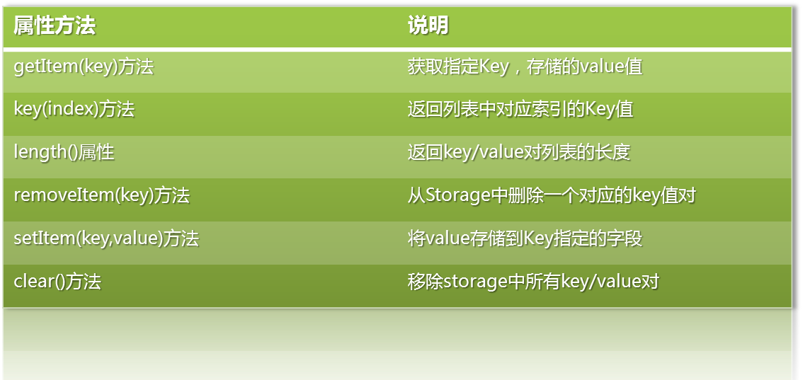

### 浏览器本地存储

#### 综述

​	本地持久化存储一直是本地客户端程序优于Web应用程序的一个方面。对于本地应用程序，操作系统会提供一个抽象层，用于存储和获取特定应用程序的数据，如用户设置或者运行时状态。这些值都可以被存储于注册表、INI文件或者其他地方，这取决于操作系统的实现。如果你的本地应用程序需要不单单是键值对的形式进行本地存储，你也可以使用嵌入式数据库、发明自己的文件格式或者其他很多种解决方案。

​	然而Web应用程序就没有这些有点了。

#### HTML5之前的解决方案

1. Cookie，本地持久存储少量数据【1993】

   网景公司的前雇员 Lou Montulli 在1993年3月的发明，为了解决HTTP无状态的特性，也可以叫用户识别机制。它的主要用途有保存登录信息。

   ***常用用户识别机制***：

   * 承载用户信息的HTTP首部
   * 客户端IP地址追踪技术，通过用户的IP地址对其进行识别
   * 用户登录，用认证机制来识别用户
   * 胖URL，一种在URL中嵌入识别信息的技术
   * cookie，一种强大且高效的持久身份识别技术

   ***缺点***：

   * cookie会包含进每一个HTTP请求，无形中增加了网络流量，会减慢web应用程序，产生不必要的重复数据。
   * cookie会包含进每一个HTTP请求，因此网络上发送的数据就不能加密（除非整个应用都是使用SSL）
   * cookie限制数据大小为4KB

2. userData【第一次浏览器大战期间】

   userData是微软在上世纪90年代的浏览器大战时推出的本地存储方案，借助DHTML的behaviour属性来存储本地数据。

   优点：

   * 每一个域名的页面可以保存64KB数据，每个站点最多640KB。
   * 可靠而且不需要安装额外插件，不需要任何授权。

   缺点：

   * 不是Web标准的一部分，仅IE可以使用

3. Flash cookie（Local Shared Object）【2002 Adobe】

   优点：

   * 可以通过Flash 8提供的ExternalInterface由javascript直接访问Flash cookie，访问速度快且操作简单。
   * 允许每个域名的Flash对象存储100KB的数据，若超出则允许按照数量级增加（1Mb、10Mb等）。

   缺点：

   * 浏览器必须安装Flash控件

4. Google Gears 【2007】

    2007年，Google 提供了 Gears，一个开源的浏览器插件，旨在为浏览器提供额外的功能。

   优点：

   * 只要用户一次授权，Gears 能够按照域名在 SQL 数据库表中存储无限大小的数据

   缺点：

   * 需安装Gear组件，且授权

**以上解决方案的弊端**：

* 不是特定于某一浏览器，就是需要安装第三方插件
* 需要对不同之处做屏蔽
* 不同的接口、不同的存储限制、不同的用户体验

**而真正需要的是**

* 更大的存储空间
* 不受页面刷新影响，不需要提交到服务器
* 浏览器通用

**HTML5 本地存储应运而生**

* 提供标准的API
* 多种浏览器原生支持
* 不需要安装第三方插件

#### HTML5 存储简介

又被浏览器厂商称为“本地存储Local Storage”或者"DOM存储DOM Storage"，是一种让web页面能够以键值对的形式，在客户端web浏览器中将数据存储在本地的方法。目前几乎所有主流浏览器最新版本都支持HTML5 Storage。HTML的DOM存储有：

1. localStorage

   检测浏览器是否支持 

   ```javascript
   function storageSupport() {  
           try {  
               return 'localStorage' in window && window['localStorage'] !== null;  
           } catch (e) {  
               return false;  
           }  
   }
   ```

   

   特点：

   * window下的一个全局对象，可以跨多个窗口，且持续范围可以超过当前会话。
   * 浏览器关闭再重新打开，数据依然是可用的。
   * 当中数据除非用户有意删除或修改，否则一直存在。

2. sessionStorage

   检测方法和属性方法同localStorage。

   特点：

   * window下的一个全局对象，维护着在页面会话（page session）期间有效的存储空间。
   * 非持久化，只要浏览器开着，页面会话一直持续。
   * 页面重新载入（reload）或被恢复（restore）时，页面会话一直存在。
   * 新建标签或窗口时，页面会话被初始化。

3. globalStorage

   非标准，使用于Firefox浏览器，类似于IE的userData

   * 赋值：globalStorage[location.hostname]\['name' ] = 'tugai';
   * 读取：globalStorage[location.hostname]\['name'];
   * 删除：globalStorage[location.hostname].removeItem('name');


#### Cookie、localStorage、sessionStorage比较

| 特性      | Cookie                                   | localStorage                        | sessionStorage                      |
| ------- | ---------------------------------------- | ----------------------------------- | ----------------------------------- |
| 数据的生命期  | 一般由服务器生成，可设置失效时间。如果在浏览器端生成Cookie，默认是关闭浏览器后失效 | 除非被清除，否则永久保存                        | 仅在当前会话下有效，关闭页面或浏览器后被清除              |
| 存放数据大小  | 4K左右                                     | 一般为5MB                              | 一般为5MB                              |
| 与服务器端通信 | 每次都会携带在HTTP头中，如果使用cookie保存过多数据会带来性能问题    | 仅在客户端（即浏览器）中保存，不参与和服务器的通信           | 仅在客户端（即浏览器）中保存，不参与和服务器的通信           |
| 易用性     | 需要程序员自己封装，源生的Cookie接口不友好                 | 源生接口可以接受，亦可再次封装来对Object和Array有更好的支持 | 源生接口可以接受，亦可再次封装来对Object和Array有更好的支持 |
|         |                                          |                                     |                                     |

`应用场景`

* Cookie：精简，判断用户登录
* localStorage：管理购物车工作，存储HTML5游戏本地数据
* sessionStorage：多表单，拆分表单为多个子页面，引导用户填写

需要注意的是，不是什么数据都适合放在 Cookie、localStorage 和 sessionStorage 中的。使用它们的时候，需要时刻注意是否有代码存在 XSS 注入的风险。因为只要打开控制台，你就随意修改它们的值，也就是说如果你的网站中有 XSS 的风险，它们就能对你的 localStorage 肆意妄为。所以千万不要用它们存储你系统中的敏感数据。

#### 参考资料

[HTML5 本地存储详解](http://www.iefans.net/html5-bendi-cunchu)

[Web 前端实现本地存储](https://segmentfault.com/a/1190000002701423)

[详说 Cookie, LocalStorage 与 SessionStorage](http://jerryzou.com/posts/cookie-and-web-storage/)


