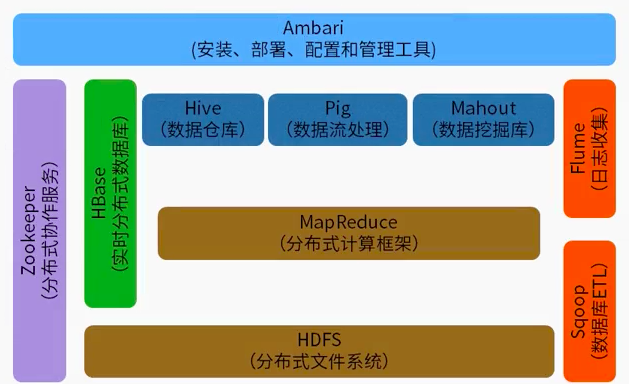

# 一、Hadoop概述

## Hadoop简介

#### 什么是Hadoop

* 一个开源的、高可靠性的、可扩展的分布式计算框架

#### 解决的问题

* 海量数据的存储（HDFS）
* 海量数据的分析（MapReduce）
* 分布式资源调度（Yarn）

#### 产生背景

* 受Google三篇论文的启发（GFS、MapReduce、BigTable）

#### 特点

* 扩容能力

* 成本低

* 高效率

  并行处理数据

* 可靠性

  数据备份

#### 应用场景

* 日志分析
* 基于海量数据的在线应用
* 推荐系统
* 计算广告
* 复杂算法
* 网盘
* 搜索引擎等 

## Hadoop生态圈

#### 核心

* Hadoop项目主要包括以下四个模块

* Hadoop Common:

  为其他Hadoop模块提供基础设施

* Hadoop HDFS:

  一个高可靠、高吞吐量的分布式文件系统

* Hadoop MapReduce:

  一个分布式的离线并行计算框架

* Hadoop YARN:

  一个新的MapReduce框架，任务调度与资源管理