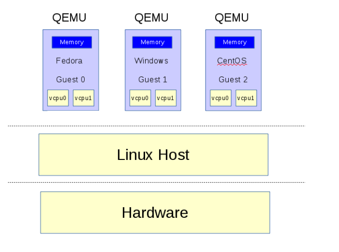

# 使用QEMU创建虚拟机

## 一、QEMU简介

开源的模拟器及虚拟机监管器（VMM）

* 模拟器：作为用户态模拟器，利用动态代码翻译机制来执行不同于主机架构的代码。
* 虚拟机监管器：模拟全系统，利用其它VMM来使用硬件提供的虚拟化支持，创建接近于主机性能的虚拟机。

## 二、基本原理

QEMU作为系统模拟器时，会模拟出一台能够独立运行操作系统的虚拟机。如下图所示，每个虚拟机对应主机(Host)中的一个QEMU进程，而虚拟机的vCPU对应QEMU进程的一个线程。

系统虚拟化最主要是虚拟出CPU、内存及I/O设备。虚拟出的CPU称之为vCPU，QEMU为了提升效率，借用KVM、XEN等虚拟化技术，直接利用硬件对虚拟化的支持，在主机上安全地运行虚拟机代码(需要硬件支持)。

QEMU发起ioctrl来调用KVM接口，KVM则利用硬件扩展直接将虚拟机代码运行于主机之上，一旦vCPU需要操作设备寄存器，vCPU将会停止并退回到QEMU，QEMU去模拟出操作结果。

虚拟机内存会被映射到QEMU的进程地址空间，在启动时分配。在虚拟机看来，QEMU所分配的主机上的虚拟地址空间为虚拟机的物理地址空间。

QEMU在主机用户态模拟虚拟机的硬件设备，vCPU对硬件的操作结果会在用户态进行模拟，如虚拟机需要将数据写入硬盘，实际结果是将数据写入到了主机中的一个镜像文件中。