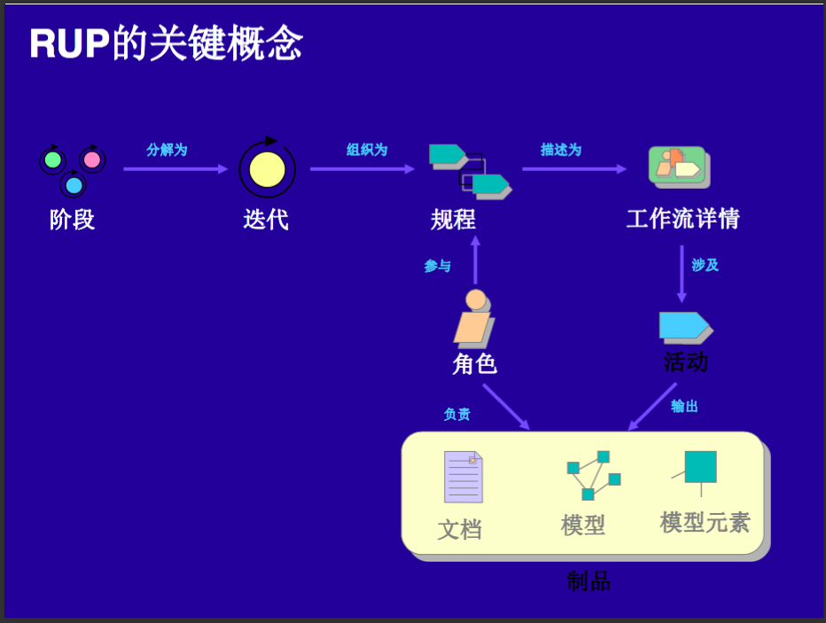

## Chapter 2-2 Software Lifetime and RUP

### Model 建模

#### 为什么要建模

* Helps you to visualize a system as you want it to be.
* Permits you to specify the structure or behavior of a system.
* Gives you a template that guides you in constructing a system.
* Documents the decisions you have made.
* Helps to better understand the system.

#### Software Teams Often Do Not Model

* Start coding from project requirements

* Work longer hours and create more code

* Lacks any planned architecture

* Doomed to failure

#### Four Principles of Modeling

* The Choice of Model Is Important

  The model you create influences how the problem is attacked.

* Levels of Precision May Differ

  Every model may be expressed at different levels of precision.

* The Best Models Are Connected to Reality

* No Single Model Is Sufficient

---

### 软件生存周期和RUP

#### 软件生存周期

* 三个时期、七个阶段

  * 软件定义

    * 问题定义：确定系统的总体目标
    * 可行性分析：研究经济、技术、操作等得可行性
    * 需求分析：收集需求，需求建模

  * 软件开发

    * 系统设计：软件架构设计、数据设计、接口设计和过程设计

    * 编码：产生源程序清单

    * 测试：产生软件测试计划和软件测试报告

  * 软件运行

    维护：修改、完善、扩展软件

#### 软件开发模型

* 传统模型

  * 瀑布模型（waterfall model）
    * 特点：阶段的顺序性和依赖性、推迟实现的观点、质量保证
    * 缺点：不适合需求模糊的系统
  * 快速原型模型（rapid prototype model）
    * 特点：快速开发工具、循环、低成本开发
    * 种类：渐进型、抛弃型

* 演化模型

  * 增量模型（incremental model）
    * 增量：小而可用的软件
    * 特点：在前面增量的基础上开发后面的增量、每个增量的开发可用瀑布或快速原型模型、迭代的思路
  * 螺旋模型（spiral model）
    * 特点：瀑布模型+快速原型+风险分析、迭代过程
    * 一个螺旋式周期
      * 规划
        * 确定目标，选择方案，选定完成目标的策略
      * 风险分析
        * 风险角度分析该策略
      * 原型开发
        * 启动一个开发阶段
      * 用户评审
        * 评价前一步的结果，计划下一轮的工作

* 形式化方法模型

  * 转换模型（transformational model）

    * 特点：

      * 形式化软件开发方法

        形式化需求规格说明、变换技术

      * 程序自动生成技术

      * 确保正确

* 面向对象过程模型

  * 构建集成模型（component integration model）
    * 特点：面向对象、基于构件库、融合螺旋模型特征、支持软件开发的迭代方法、软件重用

#### Rational 统一过程

* 概念

  * Rational Unified Process（RUP）是软件工程的过程。它提供了在开发组织中分派任务和责任的纪律化方法。它的目标是在可预见的日程和预算前提下，确保满足最终用户需求的高质量产品。
  * RUP以适合于大范围项目和机构的方式捕捉了许多现代软件开发过程的最佳实践。

* 软件生命周期

  * 四个阶段
    * 先启：定义整个项目的范围
      * 确定项目开发的目标和范围
      * 定义主要需求
      * 根据一些主要用例场景来构建一个基本架构
      * 估算开发周期和成本
      * 估计潜在的风险
    * 精化：制定项目计划、描述功能、建立体系架构框架
      * 尽快稳定并验证软件架构
      * 定义所有需求
      * 确定项目开发前景
      * 为构建阶段制定一个详细的开发计划
    * 构建：构造软件产品
      * 尽快完成软件产品的开发
      * 尽可能降低开发成本，优化开发资源和避免不必要的返工
      * 在保证开发进度的同时达到足够的软件质量
      * 获得一些有用的版本（alpha，beta等）
    * 产品化：将软件产品移交到最终用户手中（移交阶段）
      * 获得涉众的认同：产品部署已经完成并且满足预定的质量标准
      * 尽快达到最终稳定的产品基线
  * 迭代是一个基于确定计划和评估标准并且产生一个可执行发布版（内部或外部的）的独特活动序列。

* 软件过程定义

  软件过程定义指由谁在什么时候做什么事情，并且如何去达到一定的目标。

  用RUP的四种主要建模元素来表达：

  * 角色
    * 需求阐释者
    * 执行活动并产生制品
    * 角色可由单个人或一个团队扮演
  * 活动
    - 描述一个用例
    - 角色被要求执行的工作单元
  * 制品
    - 由过程生成，修改或使用的一段信息
  * 工作流
    * 描述有意义的活动序列

* 规程

    最后，所有的过程元素（角色、活动和制品等）被划分到不同的逻辑容器中，称为**规程**。

  * 软件生命期和软件过程的集成
  * 规程产生模型
  * 规程指导迭代化的开发

* RUP的关键概念

  * 阶段分解为迭代
  * 迭代组织为规程
  * 规程描述为工作流详情
  * 角色参与规程并负责制品（文档、模型、模型元素）
  * 工作流详情涉及活动
  * 活动输出制品

  

  ​

