# 常用命令

## 目录与路径操作

#### ls

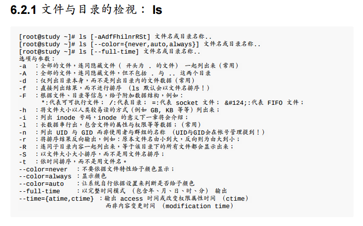

## 文件与目录管理

#### cp

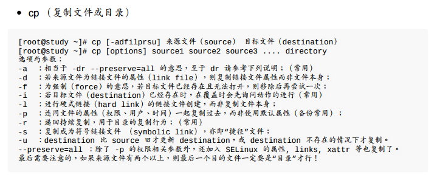

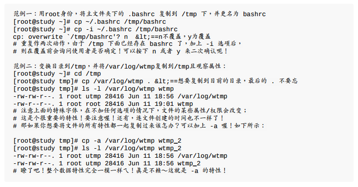

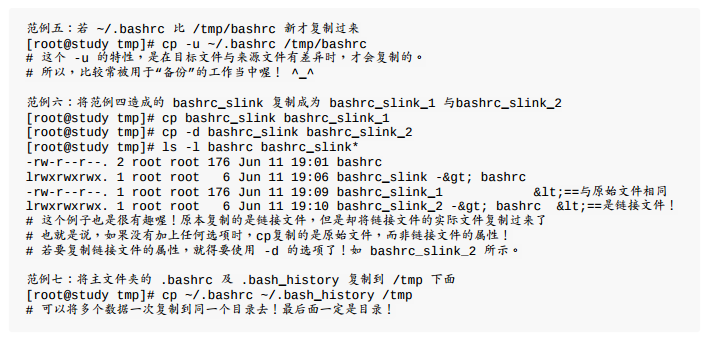

#### rm

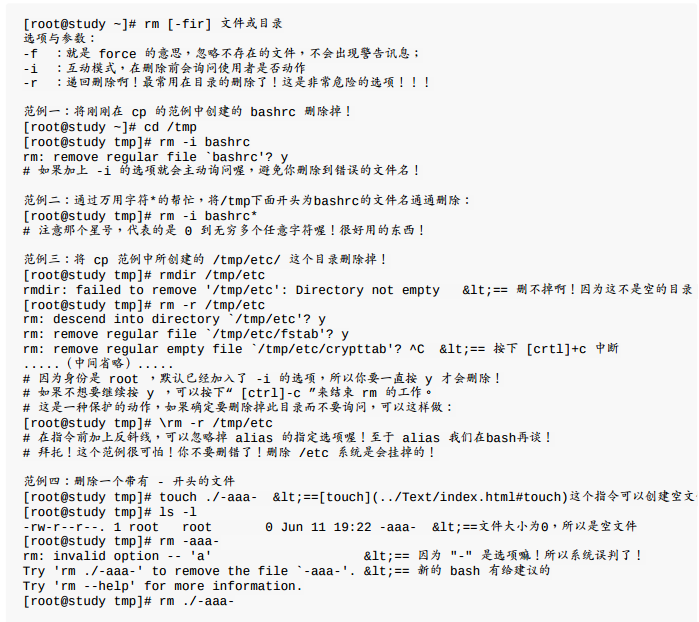

#### mv

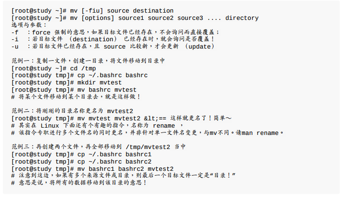

## 文件内容查阅

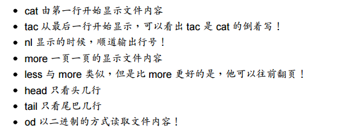

#### cat

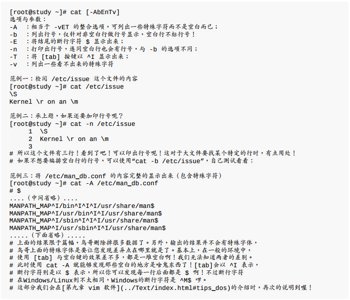

#### tac

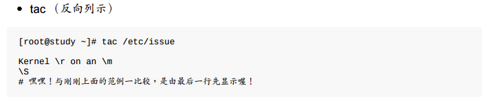

#### nl

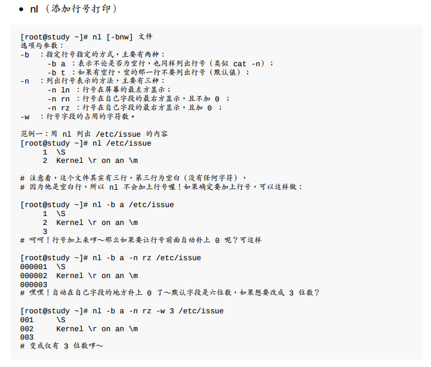

#### more(可翻页)

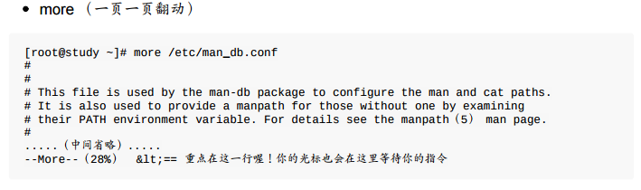

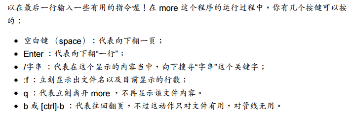

#### less(可翻页)

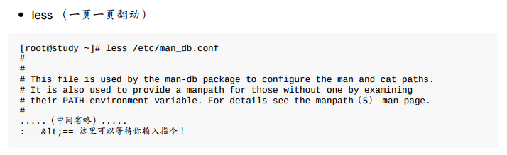

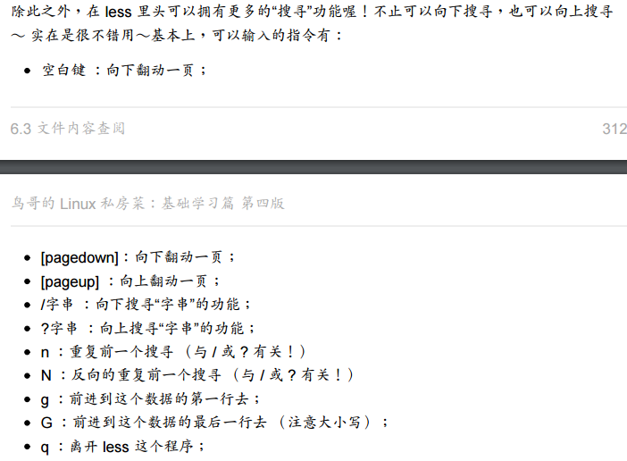

#### head

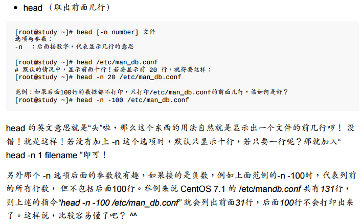

#### tail

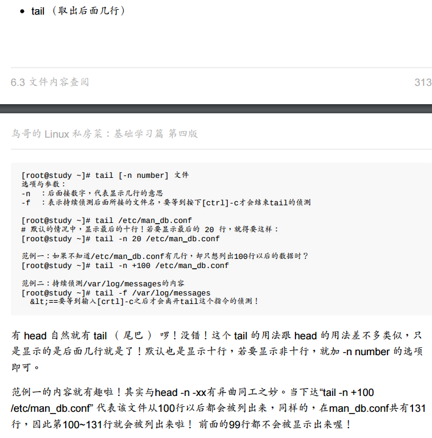

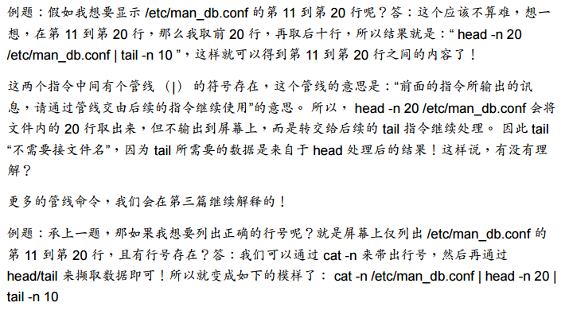

#### od(非纯文本文件)

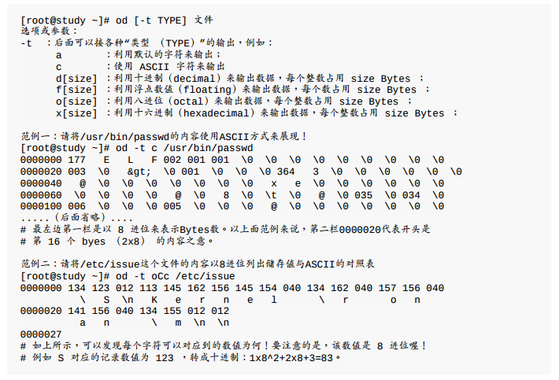

#### 修改与创建文件 - touch

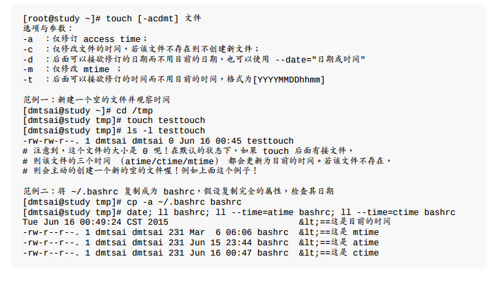

## 文件与目录的默认权限与隐藏权限

#### 文件隐藏属性 - chattr

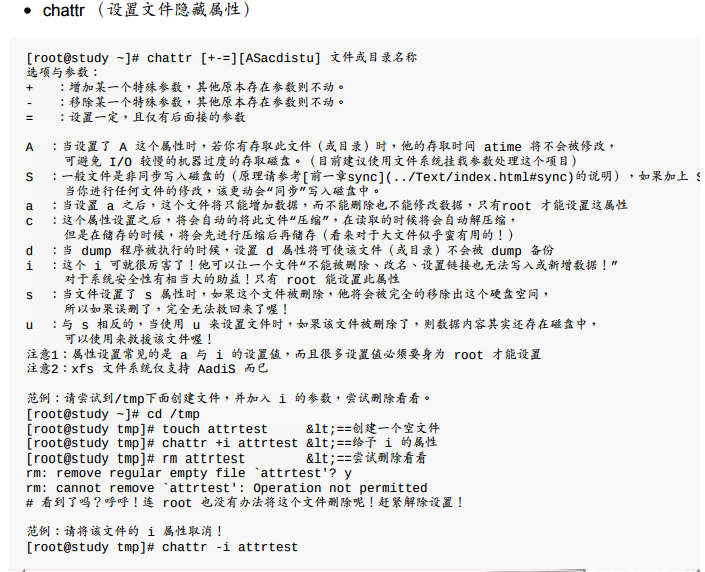

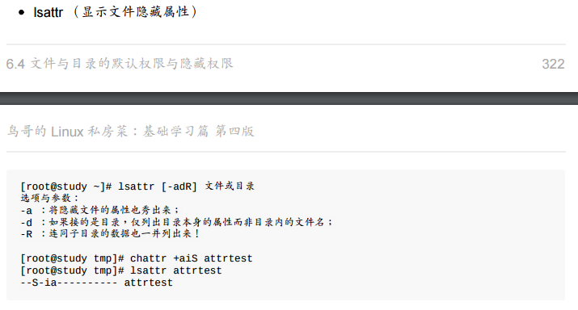

#### 文件特殊权限 SUID SGID SBIT

* SUID

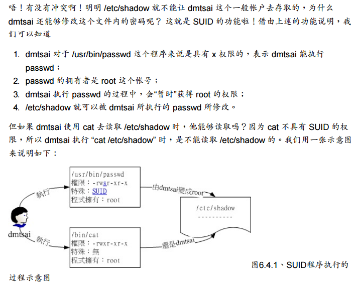

* SGID

  

  ​

  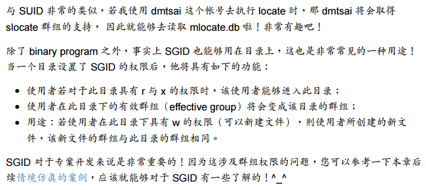

  * SBIT

    

    ​

  ​

  ## 文件搜寻

  #### find (硬盘全局查找，速度慢)

  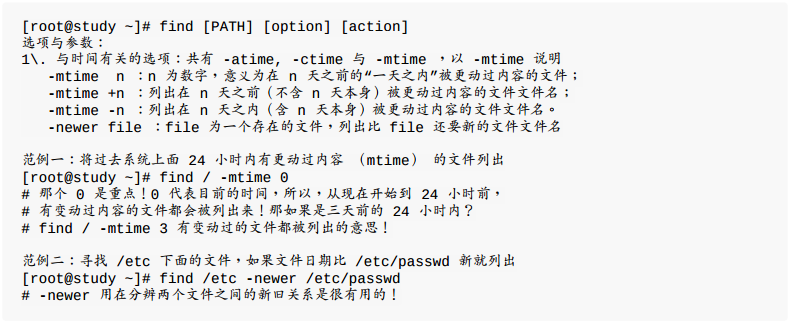

  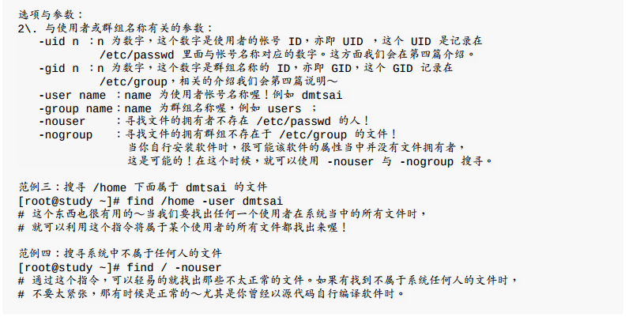

  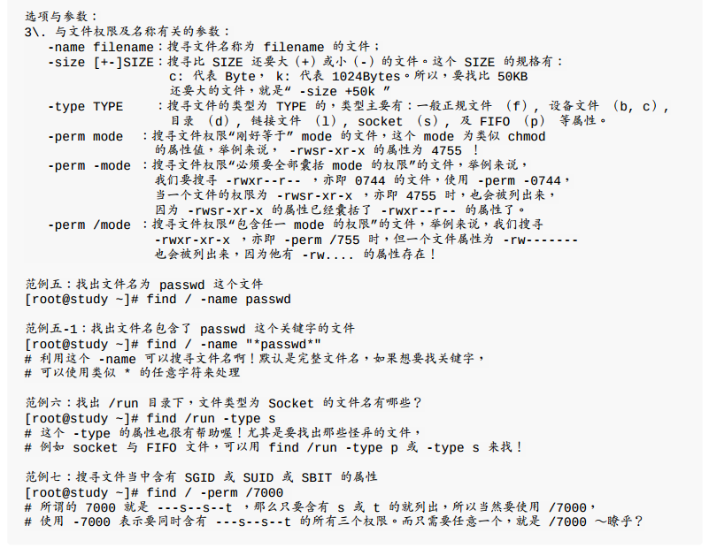

  ​

  ​

